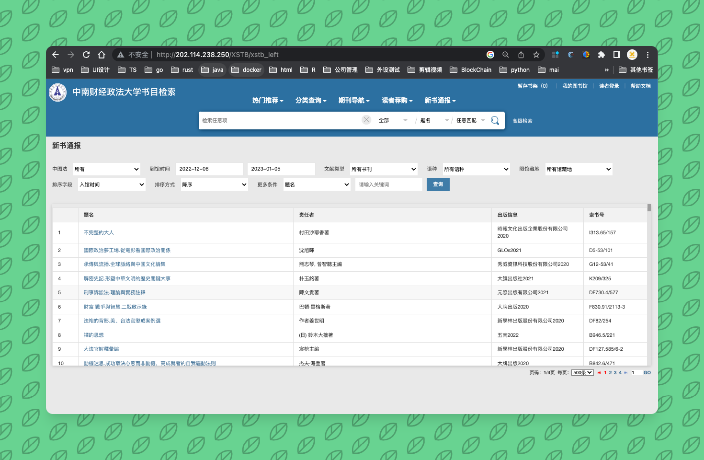

## go-goquery-spider
>基于goquery抓取ZUEL图书馆的书籍信息

## 相关链接
- [goQuery](https://github.com/jaeles-project/gospider)
- [curl-to-go](https://www.scrapingbee.com/curl-converter/go/)
- [zuel library info](http://202.114.238.250/XSTB/xstb_left)
